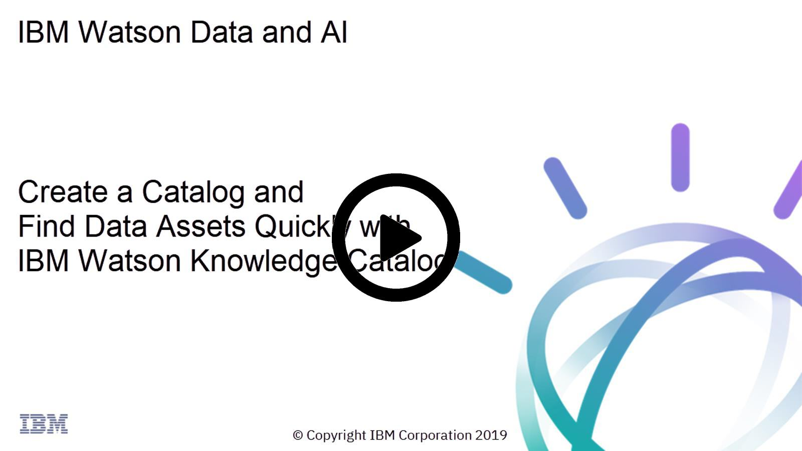

# Tutorial: Create and manage access to a catalog

Follow these steps to create a catalog, and manage assets in the catalog. You can use your own data files, or download the sample data files from this [github repository](https://github.com/sharynr/tutorial-files).

You may want to watch this video first to see how to create a catalog and find assets in a catalog.

Find other videos in the [Watson Knowledge Catalog documentation](https://dataplatform.cloud.ibm.com/docs/content/wsj/getting-started/videos.html?audience=wdp#wkc).

## Create and manage access to a catalog

### Follow these steps to create a catalog.
1. Click **Catalogs->View All Catalogs** to get to the Your Catalogs page, and then click **New Catalog**.
1. Specify these properties:
   * A name and optional description for the catalog.
   * The IBM Cloud Object Storage service. A dedicated storage bucket for the catalog is automatically created.
   * Whether to enforce data policies on the catalog. If you enable it, you can’t disable it. [See Data governance](https://developer.ibm.com/clouddataservices/docs/data-catalog/get-started/governance/governance.html).
1. Click **Create**. Your new catalog opens. You can start [adding assets](https://developer.ibm.com/clouddataservices/docs/data-catalog/get-started/tutorial-create-a-catalog-and-manage-assets/assets-catalog.html) and [collaborators](https://developer.ibm.com/clouddataservices/docs/data-catalog/get-started/tutorial-create-a-catalog-and-manage-assets/catalog-collaborators.html) to it. You have the Admin role within the catalog.

### (Optional) Follow these steps to add one or more collaborators to a catalog.

1. On the Access control page, click **Add Collaborator**.
1. Enter the user’s name or IBMid in the **Collaborators** field and then select the user in the search results. You can copy multiple IBMid email addresses, separated by spaces, and paste them into the **Collaborators** field.
1. Specify the role for all users [See Catalog collaborator permissions](https://developer.ibm.com/clouddataservices/docs/data-catalog/get-started/tutorial-create-a-catalog-and-manage-assets/cat-collab-permissions.html):
   * Viewer: can only look at the catalog
   * Editor: can use, add, and control access to assets.
   * Admin: has full control of the catalog.
1. Click **Add**.

## Add assets to a catalog
### Follow these steps to add a local file to a catalog.

1. Click **Add to catalog->Local file**.
1. Browse for the files you downloaded from the GitHub repository or drag them onto the drop area.
1. (Optional) Specify the [asset properties](https://developer.ibm.com/clouddataservices/docs/data-catalog/get-started/tutorial-create-a-catalog-and-manage-assets/assets-catalog.html).
1. Click **Add**. The asset is added to the catalog and the file starts loading into the catalog’s storage. Do not leave the catalog before the file finishes loading.

### Follow these steps to add a connection to a data source.

1. Click **Add to catalog->Connection**.
1. Choose a data source.
1. Enter the connection information required for your data source. Typically, you need to provide information like the host, port number, user name, and password.
1. (Optional) Select the **Discover data assets** option. This allows you add all data assets from the connection to the specified project. Then you can evaluate and refine the data assets before you publish them to the catalog. See [Discovering data assets from a connection](https://developer.ibm.com/clouddataservices/docs/data-catalog/get-started/tutorial-create-a-catalog-and-manage-assets/discover-assets.html).
1. Click **Create**.

### Follow these steps to add a connected data asset to a catalog.

1. Click **Add to catalog->Connected asset**.
1. Select an existing connection asset as the source of the data.
1. Navigate to the data you want, and click **Add**.
1. (Optional) Specify the other [asset properties](https://developer.ibm.com/clouddataservices/docs/data-catalog/get-started/tutorial-create-a-catalog-and-manage-assets/assets-catalog.html).
1. Click **Add**. The asset appears on the catalog **Browse** page.

### Follow these steps to add a folder asset from a connection to a catalog.

1. If necessary, create a connection asset. Include an Access Key and a Secret Key to your IBM Cloud Object Storage connection to enable the downloading of files within the folder asset. If you’re using an existing IBM Cloud Object Storage connection asset that doesn’t have an Access Key and Secret Key, edit the connection asset and add them. The Access Key and Secret Key are the HMAC credentials access_key_id and secret_key_id and you generate them in your IBM Cloud Object Storage credentials by adding the inline configuration parameter {"HMAC":true}. For more information, see [IBM Cloud Object Storage Service credentials](https://console.bluemix.net/docs/services/cloud-object-storage/iam/service-credentials.html#service-credentials).
1. Click **Add to catalog->Connected asset**.
1. Click **Select Source** to select an existing connection asset as the source of the data.
1. Navigate to the folder you want, and click **Add**.
1. (Optional) Specify the other [asset properties](https://developer.ibm.com/clouddataservices/docs/data-catalog/get-started/tutorial-create-a-catalog-and-manage-assets/assets-catalog.html).
1. Click **Add**. The asset appears on the catalog **Browse** page.
1. Click the folder asset name to view the contents of the folder asset. Click the **eye** icon next to a file name to preview the contents of the files within the folder that have these formats:
   * CSV
   * JSON
   * Parquet

### Follow these steps to publish an asset from a project to a catalog.

1. From the project, select the assets that you want to publish to the catalog, and click **Publish**.
1. Choose the catalog, and fill in the asset properties. If any of the assets require a connection, those connections are listed and will be added to the catalog as connection assets, including connections to IBM Cloud Object Storage for uploaded files. If you don’t want to publish a connection, you can remove it. All assets that require the removed connection are removed from the list of assets to publish.
1. If you are publishing a dashboard asset, you can provide a preview by taking and attaching screen captures.
1. Click **Publish**. The assets are added to the catalog and you are the owner of them.
1. After an asset appears on the catalog **Browse** page, click its name to view and update it.

## Add assets from a catalog to a project

### Follow these steps to add data assets from a project to a catalog.

1. From your project, click the **Find and Add Data** icon.
1. Click the **Catalog** tab, and choose a catalog name.
1. Select the assets you want, and click **Add to Project**.
1. Review your selection, and click **Add**. If the assets require connections, the connection assets are also listed to be added to the project, including connections to IBM Cloud Object Storage for uploaded files.

### Follow theset steps to add assets to a project from the catalog.

1. From the catalog **Browse** page, search for the assets you want to add and select them.
1. Click **Add to Project**. If any of the assets require a connection, those connections are listed and will be added to the project as connection assets, including connections to IBM Cloud Object Storage for uploaded files. If you don’t want to add a connection, you can remove it. All assets that require the removed connection are removed from the list of assets to add.
1. Choose the project name.
1. Click **Add**.
